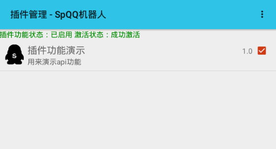
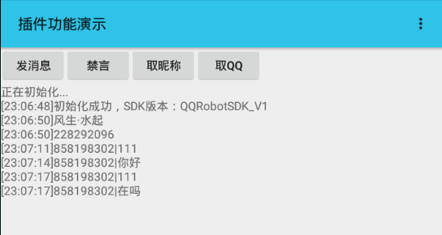

# SpQQ机器人插件Api功能演示

## 项目说明

> [SpQQ机器人](https://www.coolapk.com/apk/com.specher.qqrobot)是一款Xposed插件，通过Hook手机QQ收发消息的相关函数，实现自动回复和群管理等功能。最新版支持插件功能，并且开放Api，你可以轻松制作属于自己的机器人。

此项目用于演示和测试SpQQ机器人的插件功能

Api更新、用法等都在此项目中同步更新

当前SDK版本v1.1 2018年1月3日

<html>

</html>

## 功能
- [x] - 群、好友文本消息收发
- [x] - 禁言
- [x] - 踢人(暂不开放)
- [x] - 群内@
- [x] - 群成员、好友资料获取
- [ ] - 发送/接收图片
- [ ] - 发送/接收混合消息
- [ ] - 群名片修改
- [ ] - 群、好友验证消息收发
- [ ] - 语音消息收发
- [ ] - 匿名消息收发

## 快速接入SpQQRobotSDK

1. 新建Android项目，并引入Jar包

Jar包所在目录： `libs\QQRobotSDK.jar`
    
2. 在 `AndroidManifest.xml` 的 Application 节点中加入以下内容：

        <meta-data
            android:name="spqqrobot"
            android:value="true" />
        <meta-data
            android:name="description"
            android:value="这里输入插件的描述" />

3. 实例化一个QQRobot对象，并初始化：
    
		//实例化一个QQ机器人对象
    	QQRobot qqrobot = new QQRobot(this);
		
		//初始化QQ机器人插件
		qqrobot.initQQRobot();

4. 调用Api实现相关功能

- 例子

        qqrobot.doGagMember(String group, String qq, String time);
        禁言某人，成功后会收到一条广播消息
        
        参数：
        group 群号
        qq 禁言的人QQ号
        time 禁言时间 单位秒 最大2592000(30天) 设置为0解除禁言

- 具体实现请看源码
        
5.安装测试

安装，然后在`SpQQ机器人`的插件列表中勾选，启动，测试效果。

## 更新日志

#### 2018年1月3日
- 新增群内艾特功能、细化消息分类
- 新增获取群员昵称功能

#### 2017年12月29日
- 完成Api基本框架编写
- 完成基本功能：群、好友文本消息收发、群内禁言指定人。